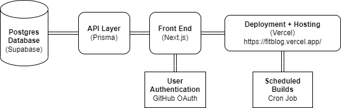

## FitBlog Project Documentation

### Deployment Info
The web application is hosted using Vercel. It can be accessed at (https://fitblog.vercel.app/).

### Technical Details
The core application uses Next.js and Prisma. User authentication is done with GitHub OAuth. The PostgresSQL backend is hosted using Supabase. The leaderboard is refreshed with a Cron Job that executes every 10 minutes. I can provide screenshots of these implementations upon private request.

### How to Use FitBlog
1. Log in with a GitHub Account by clicking on the `Log In` button top right. Ensure that your email on your GitHub account is public. After signing in, you will land on the FitBlog Public Feed page. All users that have published posts will show up here.
2. Create a new post by clicking on `New post` in the top right. Here you can create a new post. Fill out an activity (e.g. Soccer), duration (e.g. 60 minutes), and any additional comments. Users earn one point for every 30 minutes of physical activity. Hit `Create` to complete your draft. Your post is not yet public. You will land on `My drafts`.
3. Click your Activity Entry and hit `Publish` to post your entry publicly. You will be redirected to the Public Feed. Note: due to Vercel, you may need to refresh the page after a few seconds to see your new post.
4. In about 10 minutes, your points will be reflected on the Leaderboard. Click on the `Leaderboard` button to see global point standings.
5. Posts can be deleted after they've been posted or from your drafts by clicking on the post and clicking `Delete`.

### Grading Instructions
No special instructions. Simply follow the steps above.

### Additional Research
No extra research was done apart from the research conducted during Sprint 2. That file has been submitted on Canvas.

### Architecture Diagram

### Startup and Configuration Files
1.	`.env` contains the `DATABASE_URL`, `GITHUB_ID`, `GITHUB_SECRET`, `NEXTAUTH_URL`, AND `NEXTAUTH_SECRET`. All of these environment variables are manually put into Vercel but not uploaded to the GitHub repo. This file can be submitted if need be.
2.	`package.json` contains all dependencies and versions.
